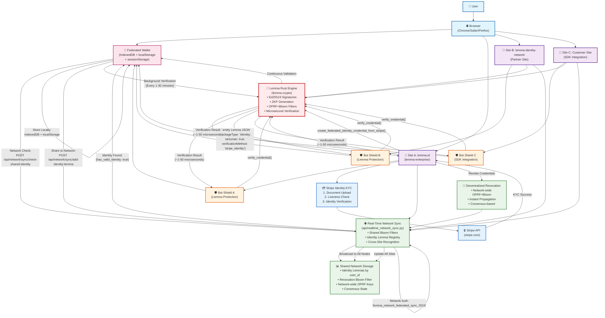

# 🌐 LEMMA IDENTITY VERIFICATION SYSTEM - COMPLETE ARCHITECTURE

## System Architecture Diagram

## 📋 SYSTEM OVERVIEW

The Lemma identity verification system is a **federated, cryptographically-secured identity network** that enables:
- **Verify Once, Access Everywhere**: Users complete Stripe KYC once and gain access to all network sites
- **Microsecond Verification**: Rust-powered cryptographic engine with ~1-50µs verification times  
- **True Decentralization**: No central authority; works across independent deployments
- **Privacy-Preserving**: Zero-knowledge proofs and minimal data storage

## 🔧 KEY COMPONENTS

### 1. 🦀 Lemma Rust Engine (`lemma-crypto`)
- **Core cryptographic operations** using Ed25519 signatures
- **Zero-Knowledge Proof (ZKP) generation** for privacy-preserving claims
- **OPRF+Bloom filter system** for efficient revocation checking
- **Microsecond-level verification** performance
- **Federated credential creation** with cross-deployment portability

### 2. 📱 Federated Wallet (Client-Side)
- **Multi-layer storage**: IndexedDB + localStorage + sessionStorage + memory cache
- **Cross-site credential sharing** via network sync API
- **Background security checks** (configurable 1-30 minute intervals)
- **Automatic network recognition** when visiting new sites

### 3. 🌐 Real-Time Network Sync
- **Shared identity lemma registry** indexed by user_id
- **Network-wide revocation bloom filters** with instant propagation
- **Consensus-based authority** using shared OPRF keys
- **WebSocket + HTTP fallback** for reliable communication

### 4. 🛡️ Bot Shield Protection
- **Automatic protection** of web elements and pages
- **Federated network integration** - checks all network sites
- **Configurable security levels** (low/medium/high/critical/realtime)
- **SDK integration** for customer sites

## ⚡ VERIFICATION FLOW

### First-Time Verification (lemma.id):
1. **User visits site** → Bot Shield checks federated wallet
2. **No credentials found** → Redirect to Stripe Identity KYC
3. **Stripe KYC completion** → Document upload + liveness check
4. **Rust engine creates identity lemma** with 3 essential claims:
   - `packageType: 'identity'` (routing)
   - `isHuman: true` (bot protection)  
   - `verificationMethod: 'stripe_identity'` (proof method)
5. **Network sharing** → Identity lemma added to shared registry
6. **Local storage** → Credential stored in federated wallet
7. **Instant access** → User passes bot shield protection

### Cross-Site Recognition (lemma-identity-network):
1. **User visits partner site** → Bot Shield initializes
2. **Wallet checks local storage** → If found, use cached credential
3. **If not found locally** → Query network sync: `POST /check-shared-identity`
4. **Network lookup** → Find identity lemma by user_id
5. **Rust verification** → ~5 microsecond cryptographic verification
6. **Automatic access** → User passes shield WITHOUT re-verification

### Network-Wide Revocation:
1. **Revocation triggered** → Any site can revoke credentials
2. **OPRF+Bloom filter update** → Add to shared network filter
3. **Instant propagation** → Broadcast to all network nodes
4. **Next verification** → Rust engine checks bloom filter
5. **Access denied** → Revoked credentials fail verification

## 🔐 CRYPTOGRAPHIC SECURITY

- **Ed25519 Digital Signatures** for credential authenticity
- **Zero-Knowledge Proofs** for privacy-preserving claims
- **OPRF (Oblivious Pseudorandom Function)** for unlinkable revocation
- **Bloom Filters** for efficient revocation checking
- **Network Authority Keys** for federated trust
- **Content Hashing** for integrity verification

## 🚀 PERFORMANCE CHARACTERISTICS

- **Verification Speed**: 1-50 microseconds (Rust engine)
- **Network Sync**: Sub-5 second propagation
- **Storage Redundancy**: 4-layer client-side storage
- **Offline Operation**: 99.9% offline verification capability
- **Cross-Site Recognition**: Instant (no re-verification needed)

## 🌐 NETWORK TOPOLOGY

The system supports a **truly federated architecture** where:
- **Any site can join** the network using the Lemma SDK
- **No central authority** required for operation
- **Shared cryptographic parameters** enable cross-site compatibility
- **Consensus-based revocation** ensures network-wide security
- **Independent deployments** can operate autonomously

This creates a **privacy-preserving, high-performance identity network** that solves the core problems of traditional identity systems while maintaining cryptographic security and user privacy.
