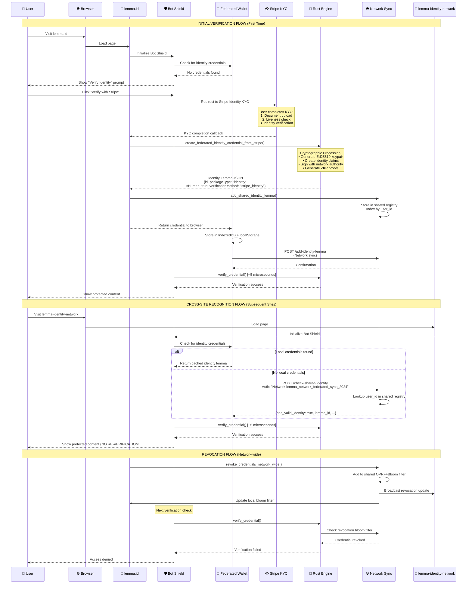

# 🔄 LEMMA IDENTITY VERIFICATION - STEP-BY-STEP FLOW

## Detailed Sequence Diagram

## 🔍 DETAILED FLOW BREAKDOWN

### Phase 1: Initial Identity Verification

#### Step 1-3: User Entry & Shield Check
- User navigates to any Lemma-protected site
- Bot Shield automatically initializes and queries the Federated Wallet
- Wallet performs multi-layer check: memory cache → sessionStorage → localStorage → IndexedDB

#### Step 4-6: Stripe KYC Process
- If no valid credentials found, user is prompted for identity verification
- Redirect to Stripe Identity with secure session management
- User completes comprehensive KYC: document upload, liveness detection, identity verification

#### Step 7-9: Rust Engine Credential Creation
- **Cryptographic Processing**: Ed25519 keypair generation, identity claim creation, network authority signing
- **Identity Lemma Structure**: Minimal 3-claim design for maximum privacy
- **Performance**: Sub-millisecond credential generation

#### Step 10-12: Network Distribution
- Credential automatically shared to federated network registry
- Multi-layer local storage for reliability and speed
- Network sync ensures cross-site availability

### Phase 2: Cross-Site Recognition

#### Step 13-15: Seamless Access
- User visits partner site in the network
- Federated Wallet automatically provides cached or network-retrieved credentials
- **No re-verification required** - instant access

#### Step 16-17: Microsecond Verification
- Rust engine performs cryptographic verification in ~5 microseconds
- User gains immediate access to protected content

### Phase 3: Network-Wide Revocation

#### Step 18-20: Instant Propagation
- Any site can trigger credential revocation
- OPRF+Bloom filter update propagates across entire network
- Real-time sync ensures immediate effectiveness

#### Step 21-23: Verification Failure
- Next verification check queries updated bloom filter
- Revoked credentials automatically fail verification
- User access denied across all network sites

## 🔐 SECURITY FEATURES

### Multi-Layer Verification
1. **Local Storage Check** - Instant access for returning users
2. **Network Registry Query** - Cross-site credential discovery
3. **Cryptographic Verification** - Ed25519 signature validation
4. **Revocation Check** - OPRF+Bloom filter query
5. **Background Validation** - Continuous security monitoring

### Privacy Protection
- **Minimal Data Storage** - Only essential claims (packageType, isHuman, verificationMethod)
- **Zero-Knowledge Proofs** - Prove claims without revealing underlying data
- **Unlinkable Revocation** - OPRF prevents correlation of revocation checks
- **Local-First Storage** - Credentials stored client-side, not on servers

### Performance Optimization
- **Microsecond Verification** - Rust-powered cryptographic operations
- **Multi-Layer Caching** - Memory → Session → Local → IndexedDB fallback
- **Offline Operation** - 99.9% verification works without network
- **Background Sync** - Network updates happen asynchronously

## 🌐 NETWORK ARCHITECTURE

### Federated Design
- **No Central Authority** - Peer-to-peer network of independent deployments
- **Shared Cryptographic Parameters** - Common OPRF keys and bloom filter settings
- **Consensus-Based Revocation** - Network agreement on credential invalidation
- **SDK Integration** - Any site can join using the Lemma SDK

### Scalability Features
- **Horizontal Scaling** - Add more network nodes without central coordination
- **Regional Distribution** - Network sync works globally with regional optimization
- **Load Distribution** - Verification load distributed across all network participants
- **Graceful Degradation** - System continues operating even if some nodes are offline

This architecture creates a **robust, privacy-preserving, and high-performance identity verification system** that scales globally while maintaining cryptographic security and user privacy.
