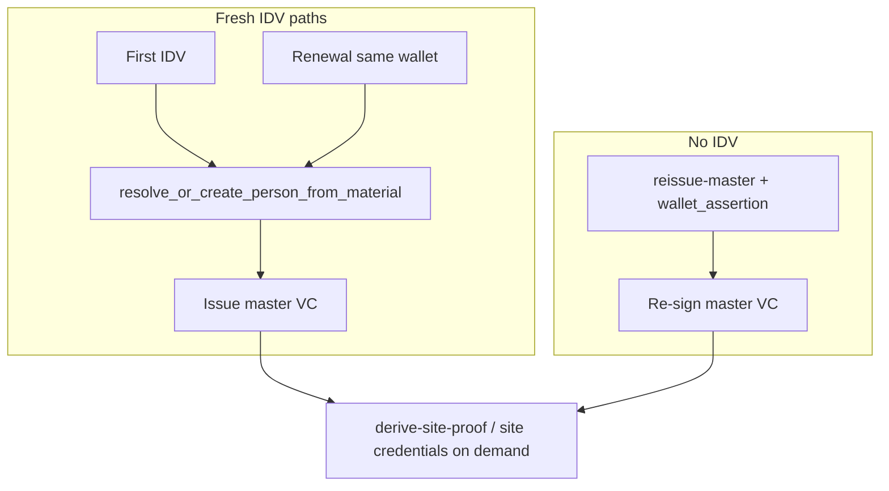

# Assigned person root (`assigned_v1`)

## Decision record (2026-06)

**Decision:** Decouple `document_root` (renewable IDV attestation) from
`person_root` (stable human anchor). New first-time identities use a
server-assigned random `person_root` (`assigned_v1`); legacy rows keep
`document_derived_v1` until naturally replaced.

**Status:** Accepted — implemented behind `LEMMA_PERSON_ROOT_SOURCE=assigned_v1`.

**Why:** isHuman needs (1) stable site-private PPIDs across passport/DL renewal,
(2) master credential TTL tied to document expiration, and (3) explicit
server-side matching of a fresh document to the wallet-bound human before
re-issuing credentials. Tying `person_root = HKDF(document_root)` makes all
three harder and forces relying sites through [PPID migration](../integration/PPID_MIGRATION.md)
on every document number change.

**Tradeoffs accepted:**

| Gain | Cost |
|------|------|
| Same PPID after document renewal (same wallet) | `person_root` is not purely re-derivable from IDV material alone for `assigned_v1` |
| Document expiry drives credential TTL | Continuity requires wallet binding + server resolution |
| Fail-closed document ↔ wallet ↔ person matching | Wallet loss + new document may mint a new person (migration opt-in) |
| Document rows usable for age/state policy without re-IDV | Slightly more centralized than pure document-hash identity |

**Not a regression:** Lemma was already server-in-the-loop for issuance,
revocation, and wallet binding. This changes *what* is stable, not whether
the platform participates.

---

## Problem

Legacy Lemma identities derive `person_root` from the verified document:

```
document_root = HMAC(document claims)
person_root   = HKDF(document_root)
PPID(site)    = HMAC(person_root, site)
```

When a user renews a passport or gets a new driver's license number, the document hash changes, which mints a **new** person and **new** PPIDs. Relying sites must run [PPID migration](../integration/PPID_MIGRATION.md) to link accounts.

## Model

With `LEMMA_PERSON_ROOT_SOURCE=assigned_v1`:

| Layer | Role |
|-------|------|
| `lemma_document_roots` | Renewable attestation from IDV (passport, DL, etc.) |
| `lemma_persons.person_root` | Stable server-assigned 32-byte secret (random) |
| `lemma_wallet_bindings` | Wallet possession binds to one `lemma_person` |
| PPID | Derived from stable `person_root`, not document number |

Re-IDV with a **new document number** on the **same wallet** attaches a new document row to the existing person and **preserves** `person_root` and all PPIDs.

## Rollout

1. Apply migration `034_assigned_person_root_source.sql` (adds `person_root_source` column).
2. Set `LEMMA_PERSON_ROOT_SOURCE=assigned_v1` on the platform when ready.
3. **Existing rows** keep `document_derived_v1`; only **new** first-time IDVs get assigned roots.
4. Wallet-bound re-IDV uses document attach for **all** persons (legacy and assigned), so PPIDs stay stable without migration when the user uses the same wallet.

## Security

- Document attach requires wallet binding to match (fail closed if document maps to a different person than the wallet).
- Fresh IDV still required for each new document attestation.
- PPID migration remains for legacy pairs where a site already recorded the wrong PPID before document attach shipped.

## Environment

```bash
# Default (legacy)
LEMMA_PERSON_ROOT_SOURCE=document_derived_v1

# New identities get assigned person_root
LEMMA_PERSON_ROOT_SOURCE=assigned_v1

# Document-root claim schema (default v2 includes issuing_subdivision)
LEMMA_DOCUMENT_ROOT_SCHEMA=v2
```

See also: document attestation fields on `lemma_document_roots` (expiration, subdivision, encrypted DOB) for age/state policy gates without re-IDV.

---

## Legacy vs assigned (comparison)

| | `document_derived_v1` (legacy) | `assigned_v1` (new) |
|---|-------------------------------|---------------------|
| **First-time IDV** | `person_root = HKDF(document_root)` | `person_root = random 32-byte secret` |
| **PPID stability** | Breaks when document number changes | Stable when same wallet re-IDVs |
| **Same document, new wallet** | Same `document_root` → same person | Same — document link resolves person |
| **New document, same wallet** | Document attach keeps person (all sources) | Document attach keeps person |
| **New document, new wallet** | New person unless document already known | New person unless document already known |
| **Recovery without old wallet** | Re-IDV + same document → same PPIDs | Re-IDV + same document → same PPIDs |
| **Master TTL** | Document expiration when stored on row | Same |
| **Client re-derivation** | Theoretically offline from document material | Requires server `person_root` (or sealed seed envelope) |

Implementation: `api/identity_person.resolve_or_create_person_from_material`,
`api/config.use_assigned_person_root()`.

---

## Issuance and re-issuance paths

Three distinct flows. Do not conflate them.

### Path A — First IDV (mint human)

```
IDV decision → document_root = HMAC(document claims)
             → resolve person:
                  • known document_root? → existing person
                  • wallet already bound?  → attach document, keep person
                  • else                   → new person (+ assigned or derived root)
             → bind wallet → issue master VC (TTL from document expiration)
```

**Fresh IDV required.** Creates or extends `lemma_document_roots` and
`lemma_wallet_bindings`.

### Path B — Document attach (renewal, same wallet)

```
Wallet bound to person A
New IDV (new passport number) → new document_root
Server: document unknown + wallet bound → attach row to person A
Result: same person_root, same PPIDs, new document attestation + expiry
```

**Fresh IDV required.** No PPID migration for relying sites when attach succeeds.
This is the primary “document renewal” path for isHuman.

### Path C — Reissue master (no fresh IDV)

```
POST /api/ishuman/reissue-master
Auth: wallet_assertion (possession of wallet signing key)
Precondition: wallet already verified
Action: new signed master VC; revoke prior master credential id
TTL: from latest document expiration on bound person (or policy fallback)
```

**No IDV.** Used after device loss recovery once identity is re-established,
credential rotation, or Bloom/revocation refresh. Does **not** attach a new
document or extend document validity — only re-signs against existing verified state.



Code references:

- Resolution: `api/identity_person.py` — `resolve_or_create_person_from_material`
- Issuance: `api/ishuman.py` — `_complete_verified_ishuman_from_didit`
- Reissue: `api/ishuman.py` — `reissue_master_credential`
- TTL: `api/ishuman.py` — `_master_credential_ttl_seconds`

---

## Server resolution algorithm

On every verified IDV completion, the server runs (simplified):

1. Derive the current `document_root_hash` from canonical document claims (never store raw document number).
2. Look up the current hash, then compatible legacy schema / pepper-version /
   IDV-provider hashes, in `lemma_document_roots` → `doc_person_id`.
3. Look up `lemma_wallet_bindings` for this wallet → `bound_person_id`.
4. **Conflict:** if both exist and differ → `WalletPersonBindingConflictError` (fail closed).
5. **Known document:** use linked person; bind the recovery wallet and, when a
   legacy key matched, attach the current hash as an alias to the same person.
6. **Unknown document + bound wallet:** attach document to bound person (`document_attached=True`).
7. **Neither:** create new `LemmaPerson` (assigned or derived `person_root`) + document link + wallet bind.

PPID at issuance:

```python
ppid = HMAC(person_root, "lemma.id/site-ppid/v1" || canonical_site)
```

The PPID is deterministic given `person_root`; IDV supplies the document
attestation that the server joins to the correct person before signing.

---

## Edge cases

### 1. Document renewal (same human, same wallet)

| Step | Outcome |
|------|---------|
| User completes fresh IDV with new passport | New `document_root` row attached to existing person |
| PPIDs | Unchanged |
| Master credential TTL | Recalculated from new `document_expiration_date` |
| Relying sites | No action — same `ppid` in presentations |

### 2. Wallet ↔ document conflict

Occurs when the wallet is bound to person A but the verified document already
maps to person B (e.g. second wallet attempting to claim someone else's document).

| Server response | User impact |
|-----------------|-------------|
| `WalletPersonBindingConflictError` | IDV fails closed; no credential issued |
| Metadata | `binding_error` on verification record |

**Intent:** prevent document hijacking across wallets. Resolution is operational
(support / explicit merge policy), not automatic silent merge.

### 3. Wallet loss — recovery paths

| Scenario | Person continuity | PPID continuity | Typical flow |
|----------|-------------------|-----------------|--------------|
| Re-IDV, **same document**, new wallet | Yes (document link) | Yes | IDV → bind wallet → optional `reissue-master` |
| Re-IDV, **new document**, new wallet | New person | New PPIDs | Sites may need [PPID migration](../integration/PPID_MIGRATION.md) opt-in |
| Old device still available | Yes | Yes | QR device transfer ([RECOVERY.md](../wallet/RECOVERY.md)) — no IDV |

**Note:** [`RECOVERY.md`](../wallet/RECOVERY.md) describes legacy
document-derived recovery (“re-verify reconstructs the same person_root”). Under
`assigned_v1`, same-document re-IDV still recovers the person via
`lemma_document_roots`, not via re-deriving `person_root` from the document hash.

### 4. PPID migration (when attach is not enough)

Migration applies when a **wallet-bound person merge** (A → B) was recorded —
typically legacy flows or wallet loss where the new IDV minted person B while
the site still stores PPIDs from person A.

**Not triggered by:**

- Document attach on same wallet (PPIDs unchanged)
- `reissue-master` alone (same PPID)

**Triggered when:** merge recorded + user derives site credential → optional
`ppid_migration` in presentation. Site opt-in only; see
[PPID_MIGRATION.md](../integration/PPID_MIGRATION.md).

At IDV start, `pin_pending_merge_metadata` records the wallet's bound person so
issuance can evaluate merge eligibility after a divergent outcome.

### 5. Expired document

| Mechanism | Behavior |
|-----------|----------|
| Master VC TTL | Capped at document expiration end-of-day UTC when known |
| Missing expiration | Falls back to policy TTL (`LEMMA_ISHUMAN_MASTER_TTL_SECONDS`) |
| Policy gates | `load_latest_person_idv_attributes` reads encrypted expiration/DOB from latest document row |

Re-IDV with a valid renewed document attaches a fresh row and re-issues with
extended TTL. `reissue-master` alone does **not** extend past stored expiration.

### 6. Legacy rows during rollout

| Row type | Behavior on re-IDV (same wallet) |
|----------|-----------------------------------|
| `document_derived_v1` | Document attach preserves existing derived `person_root` |
| New first-time IDV after flag | Gets `assigned_v1` random root |

No bulk migration of existing `person_root_hash` values. PPIDs stay stable for
legacy users who renew on the same wallet thanks to document attach.

---

## Operator checklist

Before enabling `assigned_v1` in production:

1. Migration `034_assigned_person_root_source.sql` applied.
2. Document-root schema version set (`LEMMA_DOCUMENT_ROOT_SCHEMA=v2` recommended).
3. Relying-site docs mention: same-wallet renewal = same PPID; migration only for divergent person merges.
4. Support runbook covers `binding_error` conflicts and wallet-loss + new-document cases.
5. Monitor `document_attached` metadata on verifications after rollout.
6. Keep old pepper material available and set
   `LEMMA_DOCUMENT_ROOT_READ_VERSIONS` during a root-key rotation.

---

## Related docs

- [PPID migration](../integration/PPID_MIGRATION.md) — site-scoped legacy → current PPID opt-in
- [Privacy architecture](PRIVACY_ARCHITECTURE.md) — what is persisted vs transient
- [Wallet recovery](../wallet/RECOVERY.md) — re-IDV and cross-device transfer
- [isHuman integration](../integration/ISHUMAN_AGENT_INTEGRATION.md) — relying-site guardrails
