# Lemma Enterprise - API Endpoints Structure

This diagram shows the complete API endpoint structure organized by functional areas.

```mermaid
graph TD
    %% API Structure
    A["API Endpoints"] --> B["Core API<br/>/api/*"]
    A --> C["SRE Monitoring<br/>/api/sre/*"]
    A --> D["Billing API<br/>/api/billing/*"]
    A --> E["Compliance API<br/>/api/compliance/*"]
    A --> F["Sandbox API<br/>/api/sandbox/*"]
    
    %% Core API Endpoints
    B --> B1["/api/health<br/>System Health"]
    B --> B2["/api/generate-challenge<br/>Auth Challenge"]
    B --> B3["/api/verify-credential<br/>Credential Verification"]
    B --> B4["/api/issue-credential<br/>Credential Issuance"]
    B --> B5["/api/verify-presentation<br/>Presentation Verification"]
    B --> B6["/api/logout<br/>Session Management"]
    
    %% SRE Monitoring
    C --> C1["/api/sre/dashboard/metrics<br/>Main Dashboard"]
    C --> C2["/api/sre/metrics/latency<br/>Performance Metrics"]
    C --> C3["/api/sre/metrics/errors<br/>Error Tracking"]
    C --> C4["/api/sre/metrics/prometheus<br/>Prometheus Export"]
    C --> C5["/api/sre/alerts/current<br/>Active Alerts"]
    
    %% Billing API
    D --> D1["/api/billing/usage/monthly<br/>Monthly Usage"]
    D --> D2["/api/billing/usage/daily<br/>Daily Usage"]
    D --> D3["/api/billing/invoice/*<br/>Invoice Management"]
    D --> D4["/api/billing/webhook/*<br/>Webhook Handlers"]
    D --> D5["/api/billing/disputes<br/>Dispute Management"]
    
    %% Compliance API
    E --> E1["/api/compliance/dashboard<br/>Compliance Overview"]
    E --> E2["/api/compliance/api-keys<br/>Key Management"]
    E --> E3["/api/compliance/data-protection<br/>GDPR/CCPA"]
    E --> E4["/api/compliance/incidents<br/>Incident Response"]
    E --> E5["/api/compliance/audits<br/>Audit Management"]
    
    %% Sandbox API
    F --> F1["/api/sandbox/status<br/>Sandbox Health"]
    F --> F2["/api/sandbox/credentials<br/>Test Credentials"]
    F --> F3["/api/sandbox/kyc/verify<br/>Test KYC"]
    F --> F4["/api/sandbox/revocation<br/>Test Revocation"]
    
    %% Styling
    classDef core fill:#e3f2fd,stroke:#1976d2,stroke-width:2px
    classDef sre fill:#fff3e0,stroke:#f57c00,stroke-width:2px
    classDef billing fill:#e8f5e8,stroke:#388e3c,stroke-width:2px
    classDef compliance fill:#fce4ec,stroke:#c2185b,stroke-width:2px
    classDef sandbox fill:#f3e5f5,stroke:#7b1fa2,stroke-width:2px
    
    class B,B1,B2,B3,B4,B5,B6 core
    class C,C1,C2,C3,C4,C5 sre
    class D,D1,D2,D3,D4,D5 billing
    class E,E1,E2,E3,E4,E5 compliance
    class F,F1,F2,F3,F4 sandbox
```

## API Categories

- **🔵 Core API** - Essential verification and authentication endpoints
- **🟠 SRE Monitoring** - Observability and performance monitoring
- **🟢 Billing API** - Usage tracking and revenue management
- **🔴 Compliance API** - Security and regulatory compliance
- **🟣 Sandbox API** - Testing and development environment

## Authentication Requirements

- **Core API**: Mixed (some public, some require API key)
- **SRE Monitoring**: API key required
- **Billing API**: API key required
- **Compliance API**: API key required
- **Sandbox API**: API key required

## Key Endpoint Groups

1. **Verification Flow**: `/api/generate-challenge` → `/api/verify-presentation`
2. **Credential Management**: `/api/issue-credential` → `/api/verify-credential`
3. **Monitoring Stack**: `/api/sre/dashboard/metrics` → `/api/sre/metrics/*`
4. **Billing Operations**: `/api/billing/usage/*` → `/api/billing/invoice/*` 