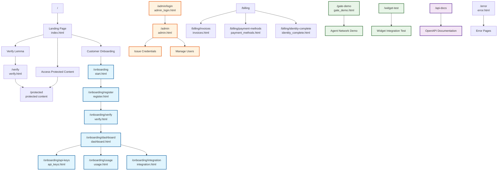

# Lemma Enterprise - Main Site Structure

This diagram shows the complete page structure and navigation flow of the Lemma Enterprise application.

## Page Categories

- **🔵 Customer Pages** - Business onboarding and management
- **🟠 Admin Pages** - System administration
- **🟣 API Pages** - Developer documentation
- **🟢 Demo Pages** - Testing and demonstration

## Key Navigation Flows

1. **Customer Journey**: Landing → Onboarding → Registration → Verification → Dashboard
2. **End User Journey**: Landing → Verification → Protected Content
3. **Admin Journey**: Admin Login → Admin Dashboard → Management
4. **Developer Journey**: Landing → API Docs → Demo Pages 