# Lemma Enterprise - System Architecture

This diagram shows the technical architecture and component relationships of the Lemma Enterprise platform.

```mermaid
graph TB
    %% Frontend Layer
    subgraph "Frontend Layer"
        A1["Landing Page<br/>index.html"]
        A2["Customer Dashboard<br/>onboarding/*.html"]
        A3["Admin Interface<br/>admin.html"]
        A4["Billing Pages<br/>billing/*.html"]
    end
    
    %% Application Layer
    subgraph "Application Layer"
        B1["Flask Application<br/>app.py"]
        B2["Route Handlers<br/>lemma/routes/*"]
        B3["Core Services<br/>lemma/core/*"]
        B4["Authentication<br/>lemma/auth/*"]
    end
    
    %% Business Logic Layer
    subgraph "Business Logic"
        C1["Credential Service<br/>credential_service.py"]
        C2["DID Resolver<br/>did_resolver.py"]
        C3["Billing Engine<br/>lemma/billing/*"]
        C4["Compliance System<br/>lemma/compliance/*"]
        C5["SRE Monitoring<br/>lemma/routes/sre_monitoring.py"]
    end
    
    %% Data Layer
    subgraph "Data Storage"
        D1["File System<br/>.lemma_enterprise/"]
        D2["Instance Data<br/>instance/data/"]
        D3["Customer Data<br/>customers/"]
        D4["Analytics Data<br/>analytics/"]
    end
    
    %% External Services
    subgraph "External Services"
        E1["Stripe Identity<br/>KYC Verification"]
        E2["CloudFlare CDN<br/>Performance"]
        E3["Heroku Platform<br/>Hosting"]
        E4["OFAC Screening<br/>Compliance"]
    end
    
    %% API Layer
    subgraph "API Endpoints"
        F1["Core API<br/>/api/*"]
        F2["SRE API<br/>/api/sre/*"]
        F3["Billing API<br/>/api/billing/*"]
        F4["Compliance API<br/>/api/compliance/*"]
        F5["Sandbox API<br/>/api/sandbox/*"]
    end
    
    %% Client-Side Components
    subgraph "Client Components"
        G1["Lemma Wallet<br/>lemma-wallet.js"]
        G2["Widget Integration<br/>lemma-wallet-init.js"]
        G3["Network Display<br/>lemma-plan.js"]
    end
    
    %% Connections
    A1 --> B1
    A2 --> B1
    A3 --> B1
    A4 --> B1
    
    B1 --> B2
    B2 --> B3
    B2 --> B4
    
    B3 --> C1
    B3 --> C2
    B3 --> C3
    B3 --> C4
    B3 --> C5
    
    C1 --> D1
    C3 --> D2
    C3 --> D3
    C5 --> D4
    
    B1 --> F1
    B1 --> F2
    B1 --> F3
    B1 --> F4
    B1 --> F5
    
    F1 --> G1
    F1 --> G2
    F1 --> G3
    
    C1 --> E1
    B1 --> E2
    B1 --> E3
    C4 --> E4
    
    %% Styling
    classDef frontend fill:#e3f2fd,stroke:#1976d2,stroke-width:2px
    classDef application fill:#fff3e0,stroke:#f57c00,stroke-width:2px
    classDef business fill:#e8f5e8,stroke:#388e3c,stroke-width:2px
    classDef data fill:#fce4ec,stroke:#c2185b,stroke-width:2px
    classDef external fill:#f3e5f5,stroke:#7b1fa2,stroke-width:2px
    classDef api fill:#fff8e1,stroke:#f9a825,stroke-width:2px
    classDef client fill:#ffebee,stroke:#c62828,stroke-width:2px
    
    class A1,A2,A3,A4 frontend
    class B1,B2,B3,B4 application
    class C1,C2,C3,C4,C5 business
    class D1,D2,D3,D4 data
    class E1,E2,E3,E4 external
    class F1,F2,F3,F4,F5 api
    class G1,G2,G3 client
```

## Architecture Layers

### 🔵 Frontend Layer
- **HTML Templates** - Server-side rendered pages
- **Stripe Design System** - Consistent UI components
- **Responsive Design** - Mobile-first approach
- **Accessibility** - WCAG compliance

### 🟠 Application Layer
- **Flask Framework** - Python web application
- **Modular Routes** - Organized endpoint handlers
- **Core Services** - Business logic abstraction
- **Security Middleware** - Authentication and validation

### 🟢 Business Logic
- **Credential Management** - W3C Verifiable Credentials
- **DID Resolution** - Decentralized identifier handling
- **Billing Operations** - Usage tracking and invoicing
- **Compliance Framework** - GDPR/SOC2 compliance
- **SRE Monitoring** - Observability and alerting

### 🔴 Data Storage
- **File-based Storage** - Local data persistence
- **Customer Management** - Business account data
- **Analytics Tracking** - Usage and performance metrics
- **Encrypted Storage** - Secure data handling

### 🟣 External Services
- **Stripe Identity** - KYC verification provider
- **CloudFlare CDN** - Global content delivery
- **Heroku Platform** - Cloud hosting infrastructure
- **OFAC Screening** - Sanctions compliance

### 🟡 API Layer
- **RESTful APIs** - Standard HTTP interfaces
- **Authentication** - API key validation
- **Rate Limiting** - Abuse prevention
- **Documentation** - OpenAPI specification

### 🔴 Client Components
- **JavaScript Wallet** - Browser-based credential storage
- **Widget System** - Easy integration components
- **Network Visualization** - Agent network display

## Key Architectural Principles

1. **Modular Design** - Separated concerns and clean interfaces
2. **Security First** - Comprehensive validation and protection
3. **Scalable Architecture** - Ready for network growth
4. **Standards Compliance** - W3C, GDPR, SOC2 adherence
5. **Developer Experience** - Easy integration and testing 