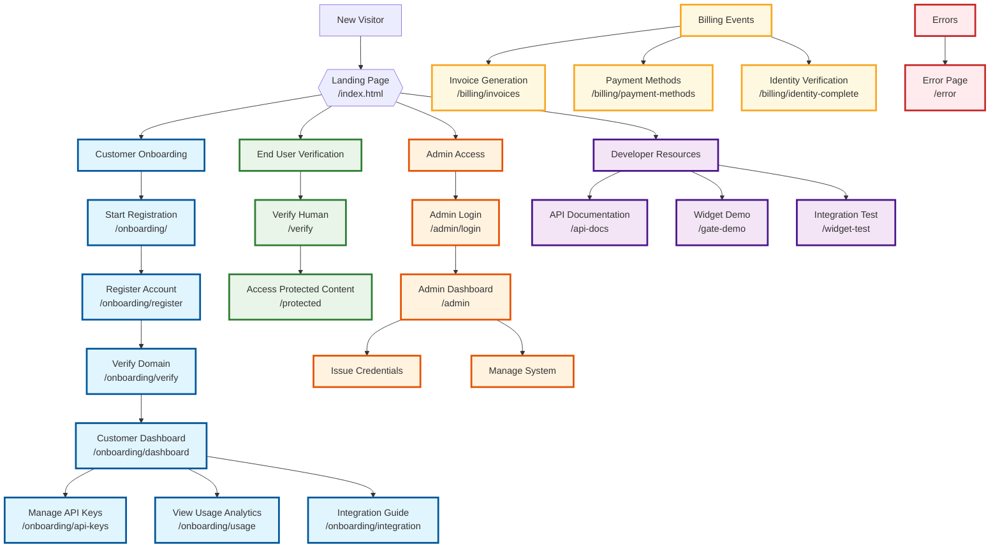

# Lemma Enterprise - User Journey Flows

This diagram shows the different user paths and workflows through the Lemma Enterprise application.

## User Journey Types

- **🔵 Customer Journey** - Business onboarding and management workflow
- **🟢 End User Journey** - Human verification and content access
- **🟠 Admin Journey** - System administration and management
- **🟣 Developer Journey** - API integration and testing
- **🟡 Billing Journey** - Payment and invoice management
- **🔴 Error Journey** - Error handling and recovery

## Journey Details

### 🔵 Business Customer Journey (7 Steps)
1. **Discovery** → Landing page introduction
2. **Registration** → Account creation and setup
3. **Domain Verification** → Ownership confirmation
4. **Dashboard Access** → Main control panel
5. **API Integration** → Key management and setup
6. **Usage Monitoring** → Analytics and tracking
7. **Ongoing Management** → Continuous operations

### 🟢 End User Journey (3 Steps)
1. **Entry** → Customer's integrated website
2. **Verification** → Human verification process
3. **Access** → Protected content and features

### 🟠 Admin Journey (4 Steps)
1. **Authentication** → Secure admin login
2. **Dashboard** → System overview and controls
3. **Management** → User and credential operations
4. **Monitoring** → System health and metrics

### 🟣 Developer Journey (3 Steps)
1. **Documentation** → API reference and guides
2. **Testing** → Demo environments and widgets
3. **Integration** → Live implementation and testing

## Key Decision Points

- **Landing Page** → Multiple user type routing
- **Customer Dashboard** → Feature access branching
- **Admin Dashboard** → Management function selection
- **Error Handling** → Recovery and support routing 