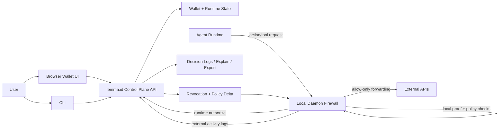

# Agent Containment System Map

This document maps how the local daemon, wallet, CLI, browser UI, and control-plane APIs work together to give users direct control over agent behavior.

## End-to-End Architecture

## Control Surfaces

- `Browser Wallet UI`
  - Human control plane for issuing credentials, revoking proofs, killing runtimes, and inspecting decisions.
- `CLI`
  - Operator automation for session linking/unlock, drills, and containment benchmark runs.
- `Control Plane API`
  - Source of truth for runtime authorization, policy snapshot, revocation delta, and decision explain/export.
- `Local Daemon Firewall`
  - Data-plane enforcement for agent side effects: method/path/scope/risk checks, proof/credential validation, and controlled forwarding.

## Daemon Interaction Model

When an agent sends a request through `/firewall/<api_id>/<path>`:

1. Resolve local policy for `api_id` (allowed methods, path prefixes, required scope, risk tier).
2. Enforce method and path allowlists.
3. Resolve auth mode by risk tier (proof-required vs compatibility path).
4. Validate proof/credential and PoP where required.
5. Apply local revocation controls (including ancestor-aware proof chain revocation).
6. Trigger runtime authorize for required risk tiers or stale-sync cases.
7. Check scope and forward only permitted requests to upstream API.
8. Log external call outcome back to control plane.

## User Control Loop

Users maintain control via a continuous loop:

1. Issue or rotate credential/proof from wallet or CLI.
2. Agent acts through daemon-enforced path.
3. Review allow/deny decisions in wallet decisions UI or exported artifacts.
4. Revoke proof or kill runtime when needed.
5. Confirm deny behavior and propagation with drills/benchmarks.

This loop provides both preventive control (pre-exec policy checks) and responsive control (rapid revoke/kill containment).

## Key Control-Plane Endpoints Used by Daemon/Ops

- Runtime authorization:
  - `/api/wallet/runtimes/<runtime_id>/authorize`
- Control-plane sync:
  - `/api/authz/revocation/delta`
  - `/api/authz/policy/snapshot`
  - `/api/authz/jwks`
- Monitoring/audit:
  - `/api/agent/monitor/log-external`
  - `/api/wallet/runtimes/decisions`
  - `/api/wallet/runtimes/decisions/<id>/explain`
  - `/api/wallet/runtimes/decisions/export`

## Why This Improves User Control

- Enforces least privilege at request time, not only at issuance time.
- Supports fast containment through revoke/kill/runtime-state checks.
- Preserves explainability with deterministic decisions and exportable evidence.
- Keeps users in control over agent authority in both normal and incident workflows.
