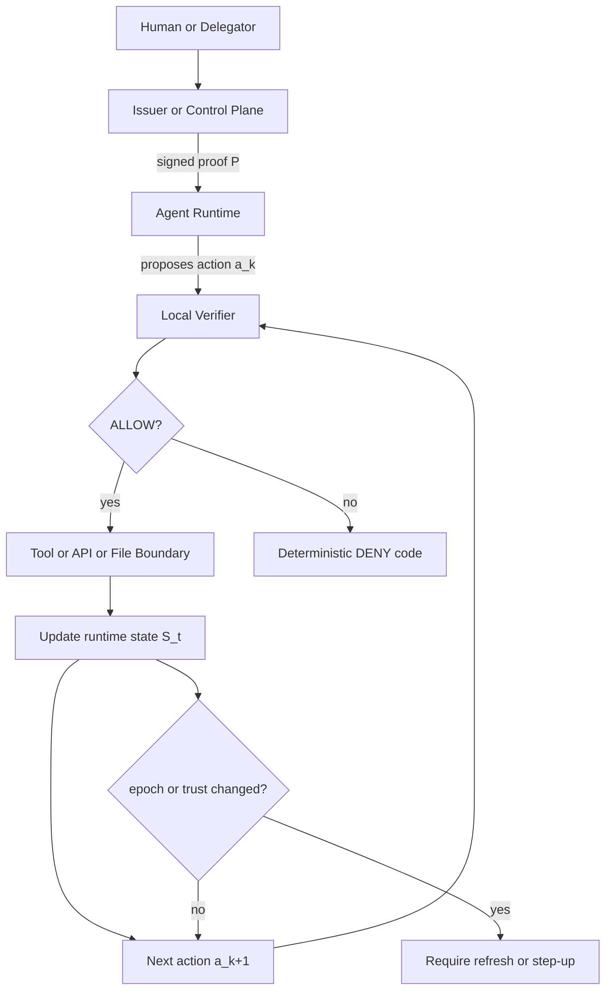
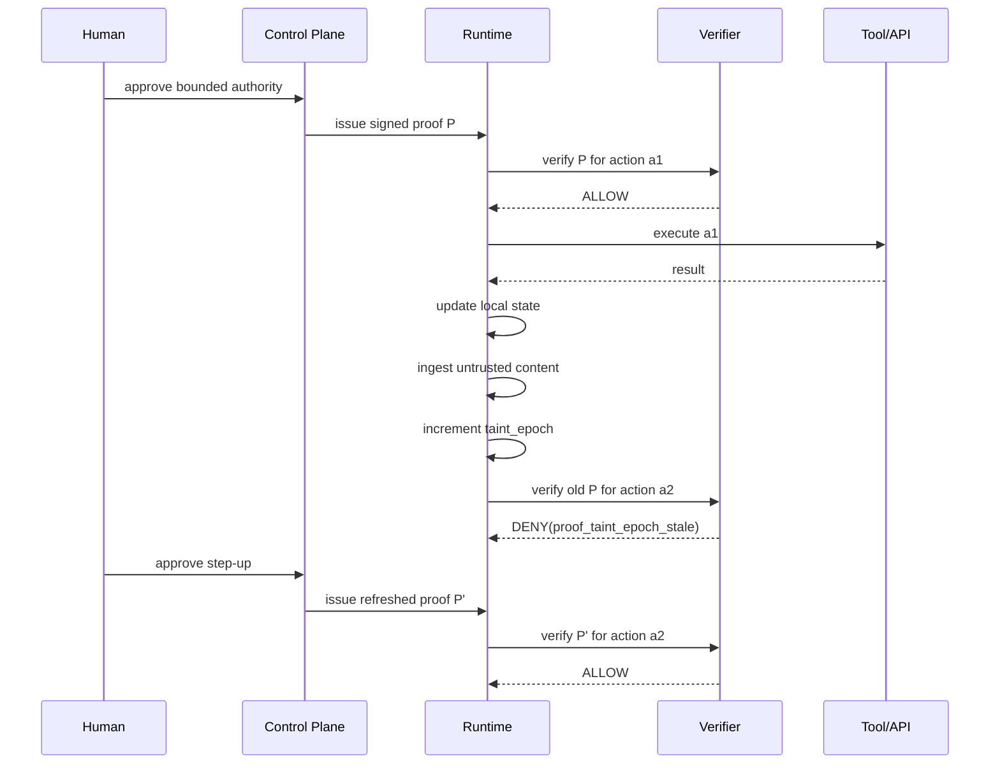
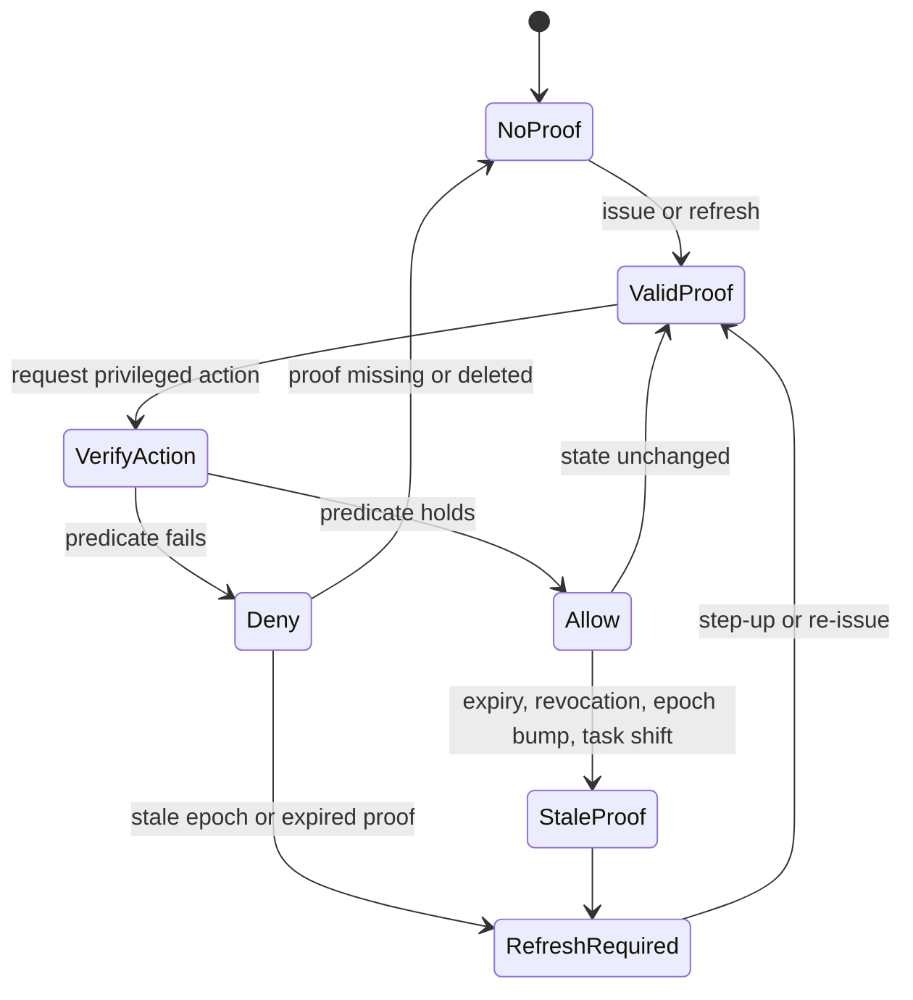

# Proof-Constrained Authorization for Action-Taking Agents
## An Internal Working Paper on Bounded Authority, Local Verification, and Between-Action Safety

### Abstract
Modern agent systems are usually governed by prompts, tool schemas, policies, and runtime wrappers. These controls are useful, but they leave an important gap: an action-taking agent often retains broad authority between steps, while the most important control state still lives in text, memory, or centralized policy paths. This paper proposes a proof-constrained authorization model for agents in which privileged actions require a signed, bounded, revocable proof that can be re-verified locally at each action boundary. The goal is not to solve model safety in general, but to separate cognition from permission. In this model, prompts guide reasoning, while proofs constrain authority. We define the proof object, the verifier predicate, the dynamic state transitions that can invalidate a previously valid proof, and the main security and liveness bounds. We also describe how the system behaves between actions, including trust-state downgrade, taint epoch changes, revocation freshness, and fail-closed behavior when proof verification is unavailable.

---

## 1. Problem Statement

Current agent architectures are mostly controlled through some combination of:
- system prompts
- developer instructions
- skill files and task playbooks
- tool schemas
- runtime approvals
- centralized policy checks
- sandboxing and environment isolation

These controls help, but they do not fully solve the authorization problem for action-taking agents.

The central issue is this:

**What an agent is told to do is not the same as what it is allowed to do.**

Prompt-level controls are advisory. They influence behavior, but they do not create a hard authority boundary. An agent can ingest new context, encounter prompt injection, delegate to subagents, or accumulate state across a long task. If authority is not re-evaluated at each privileged step, then the system effectively relies on model obedience rather than enforceable permission.

This is acceptable for pure text generation. It is not acceptable for:
- coding agents
- shell-capable agents
- deployment agents
- browser agents
- ticket or CRM automators
- infra agents
- any agent that can read secrets, mutate state, or trigger real-world side effects

This paper explores a different model:

**Privileged authority should be expressed as a signed proof and validated at each action boundary, not stored only in prompts or assumed from prior approval.**

---

## 2. Core Thesis

The thesis of this paper is:

**Action-taking agents should be controlled by proof-constrained authority, not prompt-constrained behavior.**

More precisely:
- prompts govern reasoning
- proofs govern permission
- runtimes enforce proofs at execution time
- dynamic state can invalidate old proofs between actions
- local verification should be possible for the hot path, subject to freshness and revocation constraints

This yields a useful separation:

| Layer | Purpose |
|---|---|
| Prompt / instructions | Shape behavior and planning |
| Tool schema | Define callable capabilities |
| Policy | Define intended access constraints |
| Proof | Bind authority to a signed, portable object |
| Runtime verifier | Enforce authority at each privileged action |

---

## 3. Design Goal

We want a system where all of the following can be true:

1. A human or trusted issuer grants an agent bounded authority.
2. The granted authority is cryptographically signed.
3. The authority is narrower than the issuer's own authority.
4. Each privileged action can be verified against that authority locally.
5. The authority can be invalidated between actions by expiration, revocation, or runtime trust changes.
6. If proof validation is missing or unavailable, privileged actions fail closed.
7. The system remains auditable after the fact.

This is not a proposal for full offline identity lifecycle management. Issuance, revocation publication, and key rotation may still depend on a control plane.

The proposed model is:

**local data-plane verification with managed control-plane lifecycle**

---

## 4. Threat Model

### 4.1 Threats in Scope
This paper considers:
- prompt injection through retrieved or external content
- instruction dilution or overwrite within context
- unauthorized widening of action scope
- stale proof replay
- continued use of proof after runtime contamination
- use of expired or revoked authority
- confused deputy behavior
- subagent privilege leakage
- proof tampering between actions
- local proof deletion or withholding
- temporary control-plane unavailability
- stale local revocation data

### 4.2 Threats Out of Scope
This paper does not claim to solve:
- model deception in general
- hallucinations
- all jailbreak techniques
- compromised operating systems
- memory scraping on a fully compromised host
- all covert channels
- all forms of exfiltration if the runtime already has broad valid authority
- full correctness of the model's internal reasoning

This is an authorization model, not a general AI safety proof.

---

## 5. Entities

We define the following entities:

- **Human principal `H`**: the user or operator on whose behalf authority originates.
- **Issuer `I`**: the trusted entity that signs proofs.
- **Delegator `D`**: the principal whose authority is being delegated.
- **Runtime `R`**: the executing environment for the agent.
- **Agent instance `A`**: the specific agent process or task worker.
- **Verifier `V`**: the local component that evaluates proofs before action.
- **Protected resource `X`**: any target of privileged action, such as file, API route, tool, secret, shell, or deployment target.
- **Control plane `C`**: the service responsible for issuance, revocation, key publication, and governance.
- **Local state `S_t`**: the runtime state at time `t`, including trust state, taint epoch, replay cache, and revocation cache freshness.

### 5.1 Notation and Domains

To make the rest of the paper more precise, we define the following domains:

- `Act`: the set of privileged actions
- `Res`: the set of protected resources
- `Scope`: the set of scope labels
- `Time`: a totally ordered time domain
- `Epoch`: non-negative integers used for taint and freshness epochs
- `Proof`: the set of well-formed proof objects
- `State`: the set of runtime states

We model an action as:

```text
a = (kind, target, args, risk, runtime_ctx)
```

where:
- `kind ∈ {file_read, file_write, shell_exec, api_call, tool_call, secret_read, deploy, ...}`
- `target ∈ Res`
- `args` is an action-specific argument tuple
- `risk ∈ {low, medium, high, critical}`
- `runtime_ctx` captures runtime identity and relevant local metadata

We model a runtime state as:

```text
S_t = (runtime_id, agent_id, task_id, trust_state, taint_epoch, replay_view, freshness_view)
```

We define the authority denoted by a proof as a subset of the action space:

```text
Auth(P) ⊆ Act
```

Informally, `Auth(P)` is the set of actions that may be allowed if all dynamic checks also pass.

---

## 6. Proof Object

We define a proof object `P` as a signed structured credential with the following fields:

```text
P = {
  version,
  issuer_id,
  subject_id,
  delegator_id,
  runtime_id,
  agent_id,
  task_id,
  scope,
  resource_bounds,
  trust_state,
  taint_epoch,
  issued_at,
  not_before,
  expires_at,
  jti,
  revocation_epoch,
  parent_proof_id,
  constraints,
  signature
}
```

### 6.1 Field Semantics

- `issuer_id`: trusted signer identity
- `subject_id`: the principal being authorized, preferably pairwise-scoped where possible
- `delegator_id`: principal whose authority is being delegated
- `runtime_id`: required binding to a specific runtime or runtime class
- `agent_id`: optional binding to a specific agent identity
- `task_id`: optional binding to a single task or workflow
- `scope`: permissions such as `file.read`, `file.write`, `shell.exec`, `deploy.dev`
- `resource_bounds`: allowed paths, domains, APIs, repos, tools, or environments
- `trust_state`: runtime trust category
- `taint_epoch`: monotonic runtime contamination counter
- `issued_at`, `not_before`, `expires_at`: temporal bounds
- `jti`: unique proof identifier
- `revocation_epoch`: optional coordination field for revocation sync semantics
- `parent_proof_id`: proof chain ancestry
- `constraints`: implementation-defined limits such as command classes, token budget, output channel, or max side effects
- `signature`: Ed25519 or equivalent signature over canonical serialized fields

### 6.2 Canonicalization Requirement
To avoid ambiguity, all signed fields must be canonically serialized before signing. If two semantically identical proofs can serialize differently, validation semantics become unreliable.

### 6.3 Derived Authority Function

For reasoning purposes, define:

```text
Auth(P) = {
  a ∈ Act :
    kind(a) permitted by P.scope and
    target(a) contained in P.resource_bounds and
    runtime(a) compatible with P.runtime_id and
    task(a) compatible with P.task_id and
    time(a) within [P.not_before, P.expires_at]
}
```

This is not yet the final allow predicate because it does not include:
- revocation freshness
- replay state
- current taint epoch
- current trust-state compatibility

Those are handled by the verifier over the current runtime state.

---

## 7. Action Model

Let the agent produce a sequence of intended privileged actions:

```text
a1, a2, a3, ..., an
```

Each action `a_k` occurs at time `t_k` and includes:
- action type
- target resource
- arguments
- runtime context

Examples:
- `file.write("/repo/src/app.ts")`
- `shell.exec("pytest tests/")`
- `api.call("POST /deploy/dev")`
- `mcp.tool("github.create_pr", args)`

The core principle of this paper is:

**Every privileged action `a_k` must pass verification at time `t_k`, not merely at session start.**

---

## 8. Verification Predicate

Define:

```text
Verify(P, a_k, S_t, T, Rv, clock) -> { ALLOW, DENY(code) }
```

Where:
- `P` is the presented proof
- `a_k` is the current action
- `S_t` is runtime state at time `t`
- `T` is the trust store for issuer keys
- `Rv` is the local revocation state
- `clock` is the verifier's time source

### 8.1 Verification Steps

`Verify` returns `ALLOW` iff all of the following hold:

1. **Proof present**
   - `P != null`

2. **Schema valid**
   - required fields exist
   - field types are valid
   - version is supported

3. **Signature valid**
   - `VerifySig(pk_I, canonical(P without signature), P.signature) = true`

4. **Issuer trusted**
   - `issuer_id ∈ T`

5. **Temporal validity**
   - `not_before <= now <= expires_at`

6. **Runtime binding**
   - `P.runtime_id` matches the executing runtime

7. **Agent/task binding**
   - if bound, `agent_id` and `task_id` match the action context

8. **Scope inclusion**
   - requested action is contained in `scope`

9. **Resource bound inclusion**
   - action target lies within `resource_bounds`

10. **Replay valid**
   - `jti` not already consumed in a prohibited way
   - or replay allowed only under declared semantics

11. **Revocation valid**
   - `P.jti` not revoked under current local revocation state

12. **Freshness valid**
   - local revocation and trust metadata are fresh enough for the action's risk class

13. **Dynamic state valid**
   - `P.taint_epoch == S_t.taint_epoch` when required
   - `P.trust_state` is compatible with current runtime trust state

If any check fails, return a deterministic deny code.

### 8.2 Verification as Inference Rules

The verifier can also be described as a conjunction of predicates:

```text
ALLOW(P, a, S_t, T, Rv, now) iff

Present(P) ∧
WellFormed(P) ∧
SigValid(P, T) ∧
TimeValid(P, now) ∧
RuntimeMatch(P, S_t) ∧
TaskMatch(P, S_t) ∧
ActionInScope(P, a) ∧
ResourceInBounds(P, a) ∧
ReplayValid(P, a, S_t) ∧
RevocationValid(P, Rv) ∧
FreshEnough(P, a, S_t) ∧
DynamicStateValid(P, S_t)
```

Equivalently, denial occurs if:

```text
DENY(P, a, S_t, T, Rv, now) iff ¬ALLOW(P, a, S_t, T, Rv, now)
```

with an implementation-defined priority rule over deny reasons:

```text
invalid_signature > issuer_untrusted > expired > revoked > stale_cache > scope_denied > ...
```

This priority matters operationally because the daemon should emit a single stable machine code for each rejected action.

### 8.3 Risk-Class Freshness Bound

Let `age(Rv, now)` be the age of the local revocation view. Let `θ(risk)` be the maximum tolerated freshness lag for the given risk class. Then:

```text
FreshEnough(P, a, S_t) iff age(Rv, now) <= θ(risk(a))
```

For example, a deployment or secret-read action may have much smaller tolerated lag than a read-only file access.

---

## 9. Between-Action State Machine

The important design question is not just what happens at issuance, but what happens **between** agent actions.

### 9.1 State Diagram

```text
        +------------------+
        |  No Valid Proof  |
        +------------------+
                 |
                 | issue / refresh
                 v
        +------------------+
        |  Valid Proof P   |
        +------------------+
                 |
                 | action request
                 v
        +------------------+
        | Verify(P, a_k)   |
        +------------------+
           |           |
        allow         deny
           |           |
           v           v
+----------------+   +------------------------+
| Execute action |   | Return deterministic   |
| and update S_t |   | deny / step-up / alert |
+----------------+   +------------------------+
           |
           | state changes: external input,
           | taint bump, expiry, revocation,
           | task switch, runtime mismatch
           v
   +------------------------+
   | Proof may become stale |
   | before next action     |
   +------------------------+
```

### 9.2 Key Principle
A proof that was valid at action `a_k` need not remain valid for action `a_k+1`.

This is essential.

### 9.3 Visual Flow





### 9.4 Transition-System View

Define the runtime transition relation:

```text
(S_t, P, a) -> (S_t+1, outcome)
```

where:
- `outcome ∈ {allow, deny(code), refresh_required, step_up_required}`
- `S_t+1` is the next runtime state after the action attempt

Then:

```text
if ALLOW(P, a, S_t, T, Rv, now)
  then (S_t, P, a) -> (Update(S_t, a), allow)
else
  (S_t, P, a) -> (DenyUpdate(S_t, a), deny(code))
```

This makes explicit that denial is itself a state transition, not just an absence of action. Denials may update:
- audit state
- replay state
- rate-limit counters
- alert state
- step-up requirements

---

## 10. Dynamic Invalidation

A previously valid proof may become invalid between actions due to any of the following:

### 10.1 Expiry
If `now > expires_at`, deny.

### 10.2 Revocation
If the proof or any ancestor proof is revoked and local revocation freshness is sufficient, deny.

### 10.3 Runtime Binding Change
If the proof is replayed into another runtime, deny.

### 10.4 Task Boundary Shift
If proof was task-scoped and the task changed, deny.

### 10.5 Taint Epoch Bump
If the runtime consumes external or mixed-trust content and increments `taint_epoch`, then:
- proofs minted at the prior epoch no longer authorize privileged action
- step-up or re-issue is required

### 10.6 Policy Mode Change
A route or tool that previously allowed compatibility mode may later require strict proof mode.

### 10.7 Freshness Failure
If revocation or control-plane metadata becomes too stale for a high-risk action, deny or degrade.

---

## 11. Mathematical Properties

This section states the desired security properties.

### 11.1 Integrity
Let `P'` be any proof derived from `P` by changing any signed field. Under the signature scheme's unforgeability assumption:

```text
Pr[VerifySig(pk_I, P', sig_P) = true] is negligible
```

Interpretation:
modifying signed authority fields breaks validity except with negligible probability.

### 11.2 Monotonic Attenuation
Let authority be modeled as a set of permitted action tuples:

```text
Auth(P) ⊆ ActionSpace
```

If `P_child` is derived from `P_parent`, then the system should require:

```text
Auth(P_child) ⊆ Auth(P_parent)
```

Interpretation:
delegation can only narrow authority, never widen it.

### 11.3 Action-Bound Soundness
If `Verify(P, a_k, S_t, ...) = ALLOW`, then the requested action lies within the proof's currently valid bounds under the verifier's state and freshness assumptions.

This is only as strong as:
- the verifier implementation
- the freshness of revocation state
- the trustworthiness of runtime state measurement

### 11.4 Revocation-Bounded Validity
Let `Δ_r` be the maximum revocation sync interval. Then a revoked proof may remain locally accepted only within the stale window bounded by `Δ_r`, assuming no real-time callback path is used.

Interpretation:
local verification trades immediate global revocation for bounded staleness.

### 11.5 State-Sensitive Invalidity
Let `E(t)` be the runtime taint epoch at time `t`. Then proof validity for privileged actions requires:

```text
P.taint_epoch = E(t)
```

Thus a proof valid at `t1` may become invalid at `t2` if `E(t1) != E(t2)`.

### 11.6 Replay Resistance
Let `jti` be globally unique within the verifier's replay horizon. The system should ensure that either:
- replay is disallowed, or
- replay is explicitly constrained to safe repeated reads or bounded workflows

Otherwise a valid proof may be reused outside intended semantics.

### 11.7 Monotonicity Over Action Sequences

Let `a1, ..., an` be a sequence of attempted actions under a single proof `P`. For each step `k`, define:

```text
Allowed_k = ALLOW(P, a_k, S_tk, T, Rv_k, t_k)
```

Then the system should not assume:

```text
Allowed_k => Allowed_k+1
```

In fact, the desired property is the opposite: validity must be recomputed at each step because:

```text
S_tk != S_tk+1
or
Rv_k != Rv_k+1
or
t_k != t_k+1
```

This is the formal statement of the "between-action" claim. Authorization is not session-monotone even when the proof blob itself is unchanged.

---

## 12. Safety and Liveness Tradeoffs

No security system is free of tradeoffs.

### 12.1 Safety
A fail-closed model improves safety by denying on:
- missing proof
- invalid signature
- stale freshness on high-risk actions
- runtime mismatch
- epoch mismatch
- revoked proof
- missing required bounds

### 12.2 Liveness
Too much fail-closed behavior harms usability:
- degraded networks can halt work
- frequent proof refreshes may slow workflows
- excessive epoch changes may cause approval fatigue

### 12.3 Practical Balance
A useful deployment strategy is risk-tiered:
- low-risk read actions may tolerate bounded stale metadata
- high-risk actions must fail closed if verification is unavailable
- critical actions may require per-action or short-lived step-up proofs

---

## 13. Failure Semantics

Suggested deny taxonomy:

- `proof_missing`
- `proof_invalid_schema`
- `proof_invalid_signature`
- `proof_issuer_untrusted`
- `proof_not_yet_valid`
- `proof_expired`
- `proof_runtime_mismatch`
- `proof_agent_mismatch`
- `proof_task_mismatch`
- `proof_scope_denied`
- `proof_resource_denied`
- `proof_replay_denied`
- `proof_revoked`
- `proof_revocation_cache_stale`
- `proof_taint_epoch_stale`
- `proof_trust_state_denied`
- `proof_verification_unavailable`

The distinction between `proof_invalid_signature` and `proof_verification_unavailable` matters. One means tampering or corruption; the other means the daemon could not safely establish validity.

---

## 14. Example Trace: Coding Agent

### 14.1 Granted Proof
A human grants a coding agent the following authority:
- `file.read` on repository root
- `file.write` only under `src/**`
- `shell.exec` only for tests and linters
- no network egress
- no access to `.env`, `.github/workflows/**`, or deployment scripts
- bound to runtime `cursor-local-1`
- expires in 20 minutes

### 14.2 Action Sequence

1. Agent reads `src/app.ts`
   - allowed

2. Agent writes `src/app.ts`
   - allowed

3. Agent attempts to write `.github/workflows/deploy.yml`
   - denied by `resource_bounds`

4. Agent attempts `curl https://example.com`
   - denied by scope and/or network constraints

5. Agent ingests untrusted external documentation
   - runtime increments `taint_epoch`

6. Agent attempts shell execution with prior proof
   - denied by `proof_taint_epoch_stale`

7. Human re-approves step-up proof at current epoch
   - shell test run allowed

This is exactly the between-action value of the model: the earlier proof is not assumed valid forever.

---

## 15. Example Trace: Infra Agent

An infra agent is granted:
- `api.call("cloud.dev.*")`
- no `cloud.prod.*`
- `secret.read` denied
- runtime-bound to `runner-17`
- proof TTL = 60 seconds

The agent can repeatedly perform development actions until:
- TTL expires
- runtime changes
- proof revoked
- control-plane freshness becomes too stale for the action class

This makes standing privilege narrower and more inspectable.

---

## 16. Why Prompts Alone Are Not Enough

All agent systems eventually emit text, structured calls, or serialized messages. That fact does not eliminate the need for action-time enforcement.

The relevant distinction is not text vs non-text.

It is:

**before side effect vs after side effect**

Prompt-only or end-of-run controls may catch bad final answers. They do not prevent already-executed actions:
- file deletion
- command execution
- secret access
- API mutation
- outbound exfiltration

Thus:
- final-output control governs what the agent says
- action-time proof verification governs what the agent does

---

## 17. Limits of the Model

This proposal has important limitations.

### 17.1 Signed Proofs Do Not Preserve Prompt Integrity
The agent may ignore or rewrite prompt instructions in memory. The model only helps if privileged action depends on proof verification, not prompt obedience.

### 17.2 Proof Deletion Is Possible
A proof can be deleted, withheld, or lost. The benefit is not that deletion is impossible, but that modified authority cannot remain valid without re-signing.

### 17.3 Local Verification Is Not Instant Global Revocation
Without an online callback, revocation remains freshness-bounded.

### 17.4 Runtime State Must Be Trustworthy
If `taint_epoch` or runtime identity can be forged by the agent itself, dynamic invalidation weakens.

### 17.5 Usability Friction Is Real
Frequent step-ups or short TTLs can make systems unusable unless risk tiers are carefully designed.

---

## 18. Open Questions

The model raises several unresolved design questions:

- Should proofs be per-task, per-step, or per-action?
- What is the right replay policy for repeated safe reads?
- How small should revocation freshness windows be by risk class?
- How should subagents inherit or derive narrower proofs?
- Can trust-state transitions be made sufficiently robust?
- What is the minimum runtime state that must be externally measured?
- Which constraints belong inside the signed proof vs outside in policy?
- Can this model interoperate with existing authz systems cleanly?
- Where is the best balance between local verification and online re-checks?

---

## 19. Working Conclusions

This paper supports the following conclusions:

1. Prompt-level control is not a sufficient authorization boundary for action-taking agents.
2. A signed, bounded, revocable proof is a promising carrier for agent authority.
3. The key enforcement point is the privileged action boundary, not merely session start or final output.
4. Local verification is practical and valuable, but only under explicit freshness and revocation assumptions.
5. Dynamic runtime state, especially trust downgrade and taint epoch changes, must be able to invalidate a previously valid proof between actions.
6. The strongest benefit of this model is not "signed instructions," but **tamper-evident, re-verifiable authority**.

The design principle can be summarized as:

**Prompts guide the agent. Proofs constrain the runtime.**

---

## 20. Next Step for the System Design

The next design stage should formalize three concrete artifacts:

1. **Proof schema**
   - the exact signed object
   - canonical serialization
   - derived proof semantics

2. **Verifier spec**
   - input fields
   - deterministic deny matrix
   - replay and freshness rules

3. **Between-action runtime state machine**
   - trusted state transitions
   - epoch bump triggers
   - step-up requirements
   - failure and degraded modes

That is the minimum needed to move from intuition to a defensible architecture.

---

## Appendix A: Minimal Visual Model

```text
+------------------+       +------------------+
| Human / Operator | ----> | Issuer / Control |
+------------------+       | Plane            |
                           +------------------+
                                    |
                                    | signed proof P
                                    v
                           +------------------+
                           | Agent Runtime R  |
                           | Agent A          |
                           +------------------+
                                    |
                         intended action a_k
                                    |
                                    v
                           +------------------+
                           | Local Verifier V |
                           | Verify(P, a_k,   |
                           | S_t, revocation) |
                           +------------------+
                              |           |
                           allow         deny
                              |           |
                              v           v
                     +----------------+  +------------------+
                     | Tool / API /   |  | Deterministic    |
                     | File / Shell   |  | error / step-up  |
                     +----------------+  +------------------+
```



---

## Appendix B: Between-Action Timeline

```text
t0: proof issued at taint_epoch = 4
t1: agent reads trusted repo files
t2: agent writes allowed source file
t3: agent consumes external webpage / untrusted doc
t4: runtime taint_epoch increments to 5
t5: agent attempts privileged shell command using old proof
t6: verifier denies: proof_taint_epoch_stale
t7: step-up proof issued for taint_epoch = 5
t8: command allowed if still within scope and freshness bounds
```

---

## Appendix C: Compact Formal Summary

Let:
- `P` be a signed proof
- `A_t` be a privileged action at time `t`
- `S_t` be runtime state
- `R_t` be revocation view at time `t`

Then:

```text
ALLOW(P, A_t) iff

SigValid(P) and
IssuerTrusted(P) and
TimeValid(P, t) and
RuntimeBound(P, S_t) and
ScopeContains(P, A_t) and
ResourceContains(P, A_t) and
ReplayValid(P, A_t, S_t) and
RevocationValid(P, R_t) and
FreshEnough(P, R_t, A_t) and
DynamicStateValid(P, S_t)
```

If not, return `DENY(code)`.

---

## Appendix D: Action Classes and Example Bounds

| Action class | Example | Typical bound in proof | Typical freshness requirement |
|---|---|---|---|
| Read-only file access | `file.read(src/app.ts)` | path prefix allowlist | moderate |
| Code mutation | `file.write(src/app.ts)` | path allowlist + task binding | medium/high |
| Shell execution | `shell.exec(pytest)` | command class allowlist | high |
| Network egress | `api.call(external)` | domain and method allowlist | high |
| Secret access | `secret.read(prod/db)` | explicit secret IDs + step-up | critical |
| Deployment | `deploy(dev)` | environment allowlist + short TTL | critical |

This table is intentionally illustrative. The point is that "proof" should not mean a generic yes/no token. It should carry a machine-checkable slice of authority that matches the risk class of the action.
