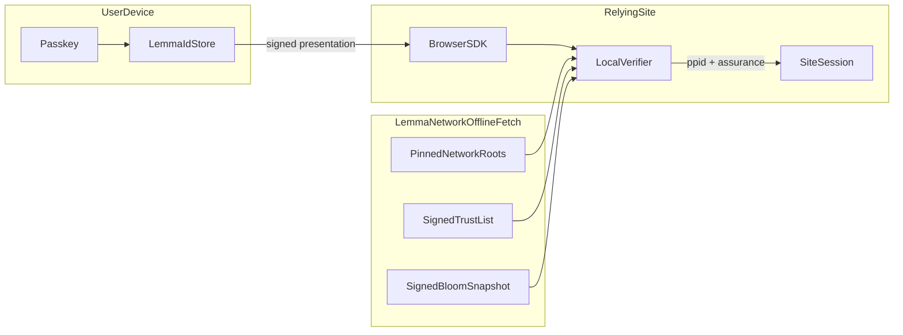

# Trust boundaries

This diagram shows the **public verification path**: what runs on the user's
device, what the relying site controls, and what lemma.id publishes for offline
fetch (not per-verification callbacks).

## Verification-path diagram

## Trust boundaries

### User device (private)

- Passkey and lemma.id signing keys **never leave the device**.
- Credentials live encrypted at rest; unlock requires WebAuthn user verification.
- The browser SDK mints signed presentations locally after passkey unlock.
- **Trust assumption:** an unlocked lemma.id on a compromised same-origin page can
  sign — see [`../SECURITY_LIMITATIONS.md`](../SECURITY_LIMITATIONS.md).

### Lemma network (published artifacts, not hot path)

- Pinned network root keys (`NETWORK_ROOT_PUBKEYS.json`).
- Signed issuer trust list (which issuer DIDs and keys are active).
- Signed Bloom revocation snapshot (refreshed on a fixed interval).
- Verifiers **fetch and cache** these artifacts; lemma.id is **not contacted on
  each login verify**.

### Relying site (your backend)

- Runs the local verifier (`packages/proof-verifier-js` or `-py`).
- Validates Ed25519 signatures, site binding, assurance policy, revocation, and
  trust-list pins **without trusting lemma.id at verify time**.
- Sees only **its own PPID** — not legal identity, not cross-site identifiers.
- Issues its own application session after successful verify.

## Data that crosses each boundary

| Crossing | Data | Does not include |
|----------|------|------------------|
| Device → RP (via SDK) | Signed presentation, optional session assertion | Private keys, other sites' PPIDs |
| Lemma → RP (periodic fetch) | Trust list, Bloom snapshot, root pins | Per-user verify telemetry |
| RP internal | `ppid`, assurance level, your session cookie | Government ID fields |

## Related docs

- Design rationale: [`../DESIGN_DECISIONS.md`](../DESIGN_DECISIONS.md)
- Security limits: [`../SECURITY_LIMITATIONS.md`](../SECURITY_LIMITATIONS.md)
- Proof semantics: [`../specs/HUMAN_AUTH_SECURITY_CONTRACT.md`](../specs/HUMAN_AUTH_SECURITY_CONTRACT.md)
- Pin regression case study: [`CASE_STUDY_TRUST_LIST_PIN.md`](CASE_STUDY_TRUST_LIST_PIN.md)
